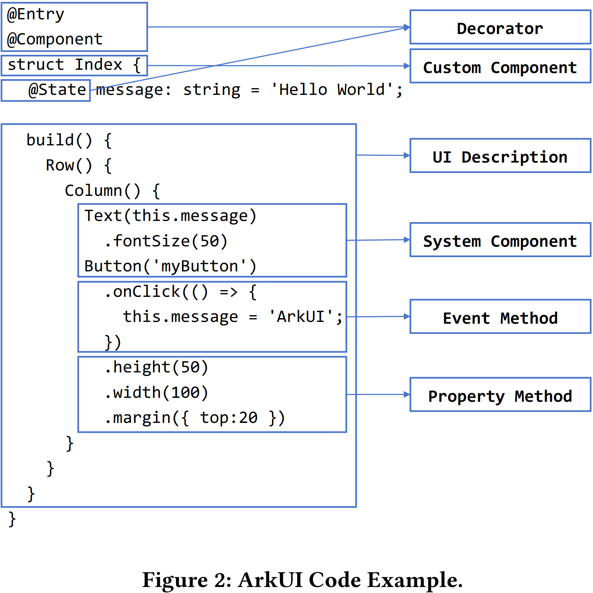
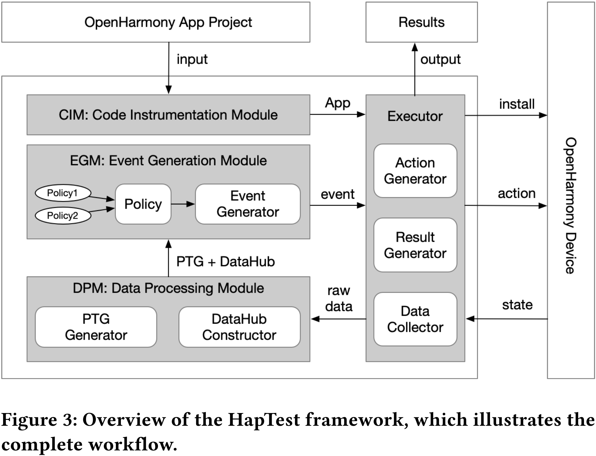

# HapTest: The Dynamic Analysis Framework for OpenHarmony

Farong Liu<sup>\*</sup>  
Beihang University  
China

Mingyi Zhou<sup>\*</sup>  
Beihang University  
China

Yakun Zhang  
Peking University  
China

Ting Su  
East China Normal University  
China

Bo Sun  
Huawei  
China

Jacques Klein  
University of Luxembourg  
Luxembourg

Xiang Gao  
Beihang University  
China

Li Li<sup>†</sup>  
Beihang University  
China

## Abstract

ArkTS is a new programming language dedicated to developing applications (apps) for the emerging OpenHarmony mobile operating system. Like other programs, apps developed with ArkTS suffer from bugs, leading to, e.g., crashes, or performance and security issues. Our community usually uses dynamic analysis to analyze the app's behavior and detect bugs. Unfortunately, a framework tailored for OpenHarmony apps dynamic analysis is not yet available for the developer community. To bridge this gap, we propose a new dynamic analysis framework named HapTest, which has been specifically designed to cope with OpenHarmony apps' original features. We make HapTest publicly available as an open-source project. Our HapTest has several fundamental dynamic analysis features (e.g., PTG, DataHub, etc.) that are ready to be reused by developers, and further customized to enable specific dynamic analysis, for instance, to detect malware or performance issues. Experiment results show that our HapTest achieves both high analysis coverage and high effectiveness. In addition, our HapTest is evaluated on the top 20 popular commercial apps from the OpenHarmony app market, each with at least millions of downloads. Our testing method revealed 26 previously unreported crashes in 11 out of the 20 applications, which demonstrates the practicality of HapTest.

## CCS Concepts

• Theory of computation → Program analysis; • Software and its engineering → Software testing and debugging.

## Keywords

OpenHarmony, Dynamic Analysis, Mobile Application Testing, ArkTS, Automated Testing, GUI Testing

<sup>\*</sup>Equal Contribution

<sup>†</sup>Corresponding Author

Permission to make digital or hard copies of all or part of this work for personal or classroom use is granted without fee provided that copies are not made or distributed for profit or commercial advantage and that copies bear this notice and the full citation on the first page. Copyrights for components of this work owned by others than the author(s) must be honored. Abstracting with credit is permitted. To copy otherwise, or republish, to post on servers or to redistribute to lists, requires prior specific permission and/or a fee. Request permissions from permissions@acm.org.

*FSE Companion '25, June 23–28, 2025, Trondheim, Norway*

© 2025 Copyright held by the owner/author(s). Publication rights licensed to ACM.  
ACM ISBN 979-8-4007-1276-0/2025/06  
<https://doi.org/10.1145/3696630.3728565>

## ACM Reference Format:

Farong Liu, Mingyi Zhou, Yakun Zhang, Ting Su, Bo Sun, Jacques Klein, Xiang Gao, and Li Li. 2025. HapTest: The Dynamic Analysis Framework for OpenHarmony. In *33rd ACM International Conference on the Foundations of Software Engineering (FSE Companion '25)*, June 23–28, 2025, Trondheim, Norway. ACM, New York, NY, USA, 10 pages. <https://doi.org/10.1145/3696630.3728565>

## 1 Introduction

Mobile applications (apps) are ubiquitous with increasingly complex program structures and interaction logic, making automated testing crucial for ensuring app quality and reliability [41]. OpenHarmony [11, 26], as a newly launched distributed system for all scenarios, has rapidly gained widespread adoption across smartphones, smart home devices, smart TVs, vehicle systems, and other IoT devices, thanks to its powerful cross-platform capabilities and distributed architecture. As of 2024, the OpenHarmony ecosystem has accumulated over 15,000 apps and 900 million devices.

Like most software, mobile apps are often buggy, leading to runtime crashes. Dynamic analysis [39, 47] is an important technique that can analyze app behavior during runtime, which observes the actual execution of programs to gather information rather than examining source code or executable files. Therefore, researchers leverage various testing techniques based on dynamic analysis tools such as fuzzing tests [15, 17, 29], model-based testing [1, 2, 5, 6, 22, 23, 40, 48], and search-based testing [3, 20, 30, 31] to dynamically explore apps to discover defective behaviors [49], GUI bugs [32], intent defects [38], crash faults [1, 33, 34, 50], etc. In addition, mobile apps are particularly sensitive to performance [25] and security issues [21, 36, 43], which can also be discovered using methods based on dynamic analysis.

However, existing dynamic program analysis frameworks for mobile apps, which primarily target Android systems, cannot be applied to OpenHarmony apps due to significant architectural differences between OpenHarmony and Android. These differences manifest in several key aspects. First, in terms of event design, OpenHarmony implements a sophisticated event-driven mechanism that encompasses both system events and interaction events, with distinct definitions and parameters from Android. For example, regarding UI construction, OpenHarmony utilizes the ArkUI framework that supports declarative development based on ArkTS, featuring its unique layout and component system architecture. Second, in

app architecture, OpenHarmony employs the Stage Model [35] that centers on `UIAbility` and implements page navigation through built-in router APIs, which differs substantially from Android's `Activity` and `Fragment` paradigm. These fundamental differences necessitate the development of new dynamic program analysis frameworks that are tailored to unique features of OpenHarmony apps, encompassing support for simulation of platform-specific event types, UI component recognition and manipulation, code coverage measurement, and verification of task management and navigation mechanisms.

To address the aforementioned challenge, we propose `HapTest`, which is the first dynamic analysis framework for OpenHarmony apps. This framework has a complete dynamic analysis workflow through four core modules: (1) Code Instrumentation Module (CIM), (2) Executor, (3) Event Generation Module (EGM), and (4) Data Processing Module (DPM). Specifically, given an OpenHarmony app, the framework first utilizes CIM to inject monitoring code at critical points in the source code to collect runtime behavioral data. Subsequently, EGM generates test events based on different strategies using the global data. The Executor then transforms these events into device-specific actions for execution and collects runtime states upon action completion. Meanwhile, the DPM is responsible for modeling and analyzing runtime data, including UI-type data `Page Transition Graph` (PTG) and text-type data `DataHub` (fault logs, app logs, coverage data, performance data, etc.). This new data is fed back to EGM to generate more accurate events, thereby achieving better coverage. This forms a cycle: event generation - event execution - data collection - data analysis. Upon completion, the Reporter generates comprehensive reports including crash reports, coverage reports, and performance reports, enabling a thorough analysis of program behavior. Our dynamic analysis method is evaluated on the top 20 popular commercial apps from the OpenHarmony App Gallery<sup>1</sup>, each having millions of downloads. The experimental results revealed 26 previously unreported crashes in 11 out of the 20 OpenHarmony apps under test, which shows the effectiveness of our `HapTest`.

The main contributions of this paper include:

- We present `HapTest`, the first dynamic program analysis framework specifically designed for OpenHarmony apps implemented with the new `ArkTS` programming language.
- Our framework introduces a novel layered and decoupled testing architecture that implements an open policy module with comprehensive real-time data support, including PTG, code coverage, crashes, and logs, allowing users to easily implement custom testing strategies.
- We evaluated `HapTest` on the top 20 popular commercial OpenHarmony apps. We detected 26 unknown crashes detected in 11 top commercial apps.
- We open-source our dynamic analysis framework at: <https://github.com/SMAT-Lab/HapTest>. The code instrumentation tool `BJC`<sup>2</sup> of our framework has been deployed on the official DevEco Studio IDE for producing coverage information.

<sup>1</sup><https://developer.huawei.com/consumer/cn/app/>

<sup>2</sup><https://www.npmjs.com/package/bjc>

## 2 Background

### 2.1 OpenHarmony App


Diagram illustrating the Stage Model of an OpenHarmony APP. The diagram shows an 'APP' container holding multiple 'HAP' (Harmony Ability Packages) containers. Each 'HAP' container contains a 'UIAbility' component, which in turn contains one or more 'Page' components. The diagram shows one HAP with two pages and another HAP with one page.

Figure 1: Stage Model of OpenHarmony APP

OpenHarmony is an open-source operating system developed and managed by the OpenAtom Foundation. It aims to provide a distributed operating system framework for smart devices across all scenarios in a fully connected world. Since its release, OpenHarmony has stood out as the most active open-source project hosted on Gitee, which is an open-source software hosting platform. OpenHarmony apps are typically developed using the Stage Model. As shown in Figure 1, an OpenHarmony app is made up of one or multiple HAPs (Harmony Ability Packages), which are the basic units for app installation and execution. Each HAP contains one `UIAbility` component, a built-in class designed to provide UI for user interactions. The concept behind `UIAbility` is comparable to `Activity` in Android except that the former could contain various UI pages while the latter generally contains only one UI page.

### 2.2 ArkTS

`ArkTS` is a new programming language for developing OpenHarmony apps. In order to benefit from the existing ecosystem of `TypeScript` (TS), which has a large number of libraries, `ArkTS` attempts to retain as many features as possible when extending the TS language. Nevertheless, compared to TS's original design, `ArkTS` makes some changes in order to support a high-performance experience that is essential for Apps running on mobile devices. Specifically, there are two main unique features: (1) introducing the `ArkUI` framework to support the implementation of UI pages (cf. Section 2.3), and (2) limiting the flexibility of TS by constraining its dynamic features that could impact execution performance. As the constraints of dynamic features only simplify the analysis, to show the gap between the TS analysis and `ArkTS` analysis, we only introduce the unique features of `ArkUI` in the next subsection.

### 2.3 ArkUI

In OpenHarmony, `ArkUI` is introduced to support the implementation of UI pages. As a declarative UI framework, compared to the traditional procedural and imperative UI approaches, `ArkUI` focuses on the outcome of the UI description. It binds the UI to reactive data, which is more efficient as developers only need to focus on data management. Additionally, the declarative UI offers a declarative description which is similar to natural languages, making it more intuitive.

The new syntactic structures introduced by `ArkUI` are one of the primary reasons why traditional JavaScript/TypeScript analysis



```

@Entry
@Component
struct Index {
  @State message: string = 'Hello World';

  build() {
    Row() {
      Column() {
        Text(this.message)
          .fontSize(50)
        Button('myButton')
          .onClick(() => {
            this.message = 'ArkUI';
          })
        .height(50)
        .width(100)
        .margin({ top: 20 })
      }
    }
  }
}

```

The diagram on the right maps the code to various components: **Decorator** (for @Entry and @Component), **Custom Component** (for struct Index), **UI Description** (for build() and Row()/Column()), **System Component** (for Text and Button), **Event Method** (for .onClick()), and **Property Method** (for .fontSize(), .height(), etc.).

Figure 2: ArkUI Code Example. A diagram showing ArkUI code on the left and its corresponding components on the right. The code defines a UI structure with decorators, custom components, system components, event methods, and property methods.

Figure 2: ArkUI Code Example.

tools cannot effectively analyze ArkTS applications. We illustrate the components of ArkUI through a simple ArkUI code example, as shown in Figure 2. This code example defines a simple page with a button. The screen will show a message “ArkUI” after pressing the button. **Decorator** features play a crucial role, with elements like @Component marking custom components, @Entry specifying entry components, and @State indicating dynamic state variables that prompt UI updates upon modification. The **UI Description** is systematically defined within the build() method, detailing the UI’s structural elements in a clear, declarative manner. **Custom Component** refers to reusable UI blocks, such as the Index structure, which can incorporate other elements and is designated by the @Component decorator. **System Component** includes fundamental and container components built into the framework, like Column, Text, Divider, and Button, offering readily accessible tools for developers. **Property Method** and **Event Method** allow for detailed customization and interaction handling within components; for instance, property methods such as fontSize(), width(), height(), and backgroundColor() adjust visual aspects, while event methods such as onClick() facilitate user engagement strategies. This architecture not only simplifies the development process but also enhances the functionality and interactivity of the application interfaces. As the fundamental difference between programming language and mobile platforms, there is a strong need to invent a new dynamic analysis framework for analyzing the behaviors, performance, and security of OpenHarmony apps.

## 3 Approach

HapTest is a dynamic program analysis framework designed for OpenHarmony apps, aiming to provide fundamental support for various app analysis tasks such as malware detection, crash localization, performance analysis, *etc.* As highlighted in Figure 3, HapTest takes as input an app repository and outputs the analysis results based on the adopted exploration strategies. HapTest leverages four modules to achieve the aforementioned purpose, namely (1) the Code Instrumentation Module (CIM), which first performs code



The diagram illustrates the HapTest framework workflow. It starts with an **OpenHarmony App Project** providing **input** to the **CIM: Code Instrumentation Module**. The CIM outputs an **App** to the **Executor** module. The **Executor** module interacts with the **OpenHarmony Device** to perform **action** and collect **raw data**. The **raw data** is sent to the **DPM: Data Processing Module**, which also interacts with the **OpenHarmony Device** to get the **state**. The **DPM** outputs **PTG + DataHub** to the **EGM: Event Generation Module**. The **EGM** uses **Policies** to generate **Event**s, which are sent to the **Executor**. The **Executor** then outputs **Results**.

Figure 3: Overview of the HapTest framework. A flowchart showing the workflow from OpenHarmony App Project to Results, involving CIM, EGM, DPM, and the Executor module, interacting with the OpenHarmony Device.

Figure 3: Overview of the HapTest framework, which illustrates the complete workflow.

instrumentation on the target application by inserting monitoring code at critical points to collect runtime data. This module will further compile and build the source code into an executable OpenHarmony app. (2) the Executor Module (EM), which is responsible for installing the app and subsequently executing the dynamic analysis process by simulating user interactions and collecting execution feedback based on the app’s running state (i.e., raw data), (3) the Data Processing Module (DPM), which transforms the raw data (collected by the EM) into structured datasets aiming to facilitate the implementation of actual dynamic analysis strategies, and (4) the Event Generation Module (EGM), the core component of this dynamic analysis framework, which is responsible for generating the next event based on the current execution state so as to guide the dynamic analysis. This module offers a policy adapter that allows users to customize the event generation policy based on their actual demands. We now detail these four modules, respectively.

### 3.1 Code Instrumentation Module (CIM)

CIM is responsible for code instrumentation [37, 42], which is crucial for coverage analysis and performance analysis. CIM uses the Identification and Insertion mechanism. Below we introduce the details of the Identification and Insertion mechanism.

**3.1.1 The mechanism of CIM.** CIM uses the Identification and Insertion mechanism. CIM identifies and locates instrumentation points using AST (Abstract Syntax Tree), whose structure allows for the precise identification and location of nodes corresponding to specific statements. Therefore, we can locate the instrumentation points in the code based on names or types. Then, it traverses the AST and inserts nodes containing code snippets in these points. Finally, CIM replaces the original AST with the modified AST.

**3.1.2 The applications of CIM.** The applications of CIM are the coverage instrumentation and the other instrumentation.

**Coverage Instrumentation.** Coverage data typically includes three aspects: lines, branches, and functions. Therefore, we need to identify the node types corresponding to these three cases. Table 1 lists the positions where we insert counting code. Specifically, we

insert counting code at all basic block, branch, and function class nodes to obtain execution counts during runtime.

**Table 1: The Types and Positions of Coverage Instrumentation**

| Type      | Position            | Insert Code  |
|-----------|---------------------|--------------|
| Function  | FunctionDeclaration | instFunction |
|           | FunctionExpression  |              |
|           | ArrowFunction       |              |
|           | MethodDeclaration   |              |
| Branch    | IfStatement         | instBranch   |
|           | SwitchStatement     |              |
|           | WhileStatement      |              |
|           | ForStatement        |              |
|           | ForInStatement      |              |
|           | ForOfStatement      |              |
|           | DoStatement         |              |
|           | TryStatement        |              |
| Statement | Basic Block         | instRegion   |

**Other Instrumentation.** Since we have established an efficient identification and insertion mechanism, it becomes straightforward to insert code with other functionalities at specified identifiers, such as debug logging, performance monitoring, and other instrumentation needs.

Notably, we have separately extracted and encapsulated CIM’s core capability of code instrumentation into a plugin called BJC and open-sourced. Furthermore, it has been integrated into OpenHarmony’s official IDE DevEco Studio [24], for which it has already been extensively used by app developers.

### 3.2 Executor Module (EM)

As a dynamic analysis framework, the Executor Module requires two essential capabilities: controlling the app and observing app states. The Executor Module is specifically designed to interact with OpenHarmony devices based on three modules. The **Action Generator** begins with simulating various events that OpenHarmony possesses. These simulated events are then translated and executed on the target app. After execution, **Data Collector** takes place to gather the latest data from device. Finally, **Result Generator** analyzes the collected data and produces comprehensive analysis reports. We detail this module as follows:

**3.2.1 Action Generator.** Action generator has two parts: the first part is event simulator, which simulates various events that OpenHarmony possesses. The simulated events are then forwarded to the second part, Event Executor, which translates and executes them on the target app.

**Event Simulator.** To recreate user scenarios, the Event Simulator supports a comprehensive set of events available in OpenHarmony, including UI events, key events and system events:

- *UIEvent.* UIEvents Represents user interactions with GUI components, including clicks, long presses, scrolls and text inputs. These events can be parameterized by either screen coordinates (x, y) or direct component references to ensure precise interaction with UI elements.

- *KeyEvent.* KeyEvent simulates hardware key operations such as volume buttons and power key, parameterized by specific key codes to replicate physical key interactions.
- *SystemEvent.* SystemEvent handles systemlevel operations including application lifecycle management (e.g., launching, terminating and switching HAPs), system settings changes, and device state modifications.

**Event Executor.** There is a difference between simulated events and executable action on devices, so we need to convert events into platform-specific commands for execution. This usually requires the help of tools, such as *UIAutomator* [14] or the debugging tool *adb* [13] in Android. In OpenHarmony, there is a similar tool called *uitest* that provides direct app manipulation capabilities.

Therefore, we deploy *uitest* as a Remote Procedure Call (RPC) [12] server on the device. All UIEvents and KeyEvents are converted into RPC requests for execution, while SystemEvents are handled through Harmony Device Connector (*hdc*) [16]. Specifically, UI interactions, page information retrieval, and screenshot capture are processed via RPC calls, where each action is encapsulated as RPC parameters following the protocol specifications defined by the device-side server. This hybrid approach combining RPC and *hdc* proves more efficient and reliable compared to traditional command-line tools (e.g., *adb*, *hdc*).

**3.2.2 Data Collector.** The Data collector is performed after each event completion. Before discussing data collection, let’s examine how the data is generated. These data come from three main sources: system (crash logs), HapTest (coverage data and UI data), and app (logs).

The OpenHarmony system can automatically collect crashes for applications. When unhandled exceptions cause unexpected application exits, the system collects these exceptions through specific mechanisms, such as capturing unhandled exceptions thrown by applications or monitoring certain POSIX signals that indicate failures. Meanwhile, coverage data is generated through the trigger of counter code previously inserted by HapTest’s CIM. HapTest also obtains UI screenshots and raw page data through RPC. In summary, all these data are generated automatically, whether they are produced by the system, the framework, or the app itself, and they are all written to their respective designated locations. Therefore, we can collect data from specific locations.

Although for data collection, OpenHarmony provides command-line tools for pulling data from the application’s data areas to local storage. However, for security, OpenHarmony applications run in sandboxes, which means only data with granted permissions can be stored in the application’s data area. As a result, the data our framework generates cannot be written to data areas, only stored temporarily in the sandbox and cleared after program exits.

Therefore, a data channel is needed for timely data collection. A feasible solution is to start a FTP service within the sandbox as a channel when the application launches, enabling continuous data pulling through FTP access during runtime.

**3.2.3 Result Generator.** The Result Generator (part of EM) generates comprehensive test reports, which cover three main aspects:

- *Coverage Report.* The Result Generator visualizes the coverage data generated by CIM through heat maps and charts, presenting

- coverage metrics at different granularities (function, class, and file levels). These metrics are helpful for identifying gaps between different exploration strategies.
- *PTG Report*. HapTest documents the complete page transition, including executed events, their parameters, timestamps, and execution results, along with detailed page information. Therefore, the event sequence is analyzed to traverse the PTG based on timestamps. In addition, the page coverage can also be analyzed.
- *Crash Report*. The Result Generator details any crash detected during runtime, including application force quits and system crashes. The Result Generator organizes the stack traces and environmental context for each crash to assist with debugging.

### 3.3 Data Processing Module

The collected data (including text-based data and UI-related data) require further processing to support optimization strategies or generate reports. The Data Processing Module (DPM) is specifically designed to process these data collected from OpenHarmony devices based on two modules. For text-based data, since they are in a human-readable format, the **DataHub Constructor** only needs to filter out the text entries related to the app under test and perform simple statistical analyses, thereby obtaining various types of text data, such as fault logs, application logs, coverage data, performance data, etc. However, UI-related data processing is more complex, requiring the parsing of pages and their component trees, as well as updating the PTG. In this section, we introduce the **PTG Generator** in detail. Specifically, the PTG Generator first builds a GUI model (see Section 3.3.1) corresponding to the Stage Model of the OpenHarmony app. Then, it constructs Pages according to the GUI model (see Section 3.3.2). Finally, it adds the pages to the PTG (see Section 3.3.3).

**3.3.1 GUI Model.** To interact with the GUI, HapTest needs to accurately identify it. To address this, we design a GUI model to handle the parsing and storage of GUI raw data, which is a non-formatted textual description of the UI page.

In OpenHarmony, the development of application generally adopts the Stage Model, as shown in Figure 1. A UIAbility instance can contain a group of related pages. Thus, we design a GUI model, which adopts a corresponding hierarchical structure consisting of the Ability, Page, and Component classes. Specifically, an Ability contains multiple Pages, while each Page hosts numerous Component. Component, as the smallest UI unit, represents a widget on the page. The component contains positional information and textual content, as well as rich attributes such as clickable, scrollable, and so on.

**3.3.2 Page Construction.** Unlike Android, where an Activity contains only one page, OpenHarmony’s app model allows multiple pages within a single UIAbility. Consequently, the ViewTree represents raw data, dumped from the foreground page, which may contain multiple pages.

Since the exploration process of dynamic analysis focuses on foreground pages, we need to identify the active page among multiple candidates. We employ a straightforward strategy. In this strategy, pages are sorted by the condition  $a.height > b.height \&\& a.width > b.width$ , and the first page is selected. We employ this strategy based

on the observation that the foreground page typically occupies the largest screen area.

Once the foreground page is identified, according to the GUI Modeling mentioned earlier, the raw data is matched and parsed to obtain a GUI instance for the page. This instance represents a complete page structure and retains the hierarchical relationships among its components, ensuring that each component’s position, attributes, and interactions are preserved.

**3.3.3 PTG Update.** When new pages and events are identified or created, they need to be updated to the PTG. The PTG is a data structure used to describe the dynamic transition relationships between pages, which helps the framework manage the flow and interaction between different pages. Specifically, with pages as nodes and events as edges, the PTG Generator adds the triplet  $< \text{lastPage}, \text{event}, \text{currentPage} >$  to the PTG. On top of the PTG, the PTG Generator maintains additional information that is valuable for EGM. For example, by implementing shortest path algorithms, we can quickly determine the minimum number of events required between pages and assess page reachability. The PTG Generator also tracks executed events for each page, which enables rapid filtering of previously executed events to avoid duplicate execution in EMG.

### 3.4 Event Generation Module

HapTest offers a policy adapter that allows users to customize the event generation policy based on their actual demands. In the following, we first introduce the policy adapter and then use one example to introduce how to use the policy adapter.

**3.4.1 Policy Adapter.** To enable users to quickly implement custom policies, we design a policy adapter with a pipeline architecture that provides several adaptation points. The pipeline consists of four main phases: Candidate Generation, Filtering, Scoring, and Selection. The Candidate Generation phase identifies potential actions based on the current application state and historical execution data. The Filtering phase applies constraints to remove invalid or undesirable actions. The Scoring phase evaluates remaining candidates using customizable metrics, while the Selection phase determines the most appropriate action to execute according to specific strategy criteria.

To facilitate the implementation of various policies, whether they are heuristic-based policy, coverage-driven policy, or learning-dependent policy, HapTest provides comprehensive structured data support, including well-processed PTG and DataHub. This rich data foundation makes policy development straightforward as developers can directly utilize these well-structured data.

Formally, a policy can be modeled as a function  $\pi(S) \to e$ , mapping the state space  $S$  to a single event  $e$ , where  $S$  represents the complete state information available for decision making, and  $e$  represents one of the generated events.  $\pi$  denotes the decision strategy.

In our Policy Adapter, we expand the state space  $S$  to provide rich contextual information for decision making. The state space includes PTG for representing the application’s structural model, Coverage for tracking test coverage metrics, CCM (Component Code Mapping) for linking UI components to source code, crash logs

for recording application failures, and general logs for capturing runtime behavior.

The decision strategy  $\pi$  is implemented as a modular pipeline consisting of four sequential operations:

$$\pi = \text{candidate} \circ \text{filter} \circ \text{score} \circ \text{select}$$

where  $\circ$  represents the pipe operation.

**3.4.2 A Policy Example.** Several built-in policies have been implemented such as Greedy Depth-First Search (DFS), Greedy Breadth-first Search (BFS) and Random approaches. As an example, the Greedy DFS Policy implements a greedy DFS exploration strategy based on PTG. In this policy, the state space  $S$  is set to PTG, which provides both the GUI model of pages and their transitions, enabling the Greedy DFS policy to consider individual widgets and backtrack to high-value pages when encountering dead ends, thereby achieving high coverage. Additionally, we customize the score function in pipeline  $\pi$  based on widgets and their associated weights. The detailed steps are summarized as follows:

- **Candidate.** The algorithm scans all unvisited components on the current page and evaluates possible executable events based on component attributes. For example, if there is a clickable component on the current page, a `ClickEvent` for this component is added to the candidate set.
- **Filter.** The algorithm filters out events that have been executed on the current page.
- **Backtrack (optional).** The algorithm backtracks to the nearest unexplored page in the PTG if no available event.
- **Score.** The algorithm sorts the events in descending order based on their scores calculated via the following scoring function.

$$\text{Score} = \sum (\text{property}_i \times \text{weight}_i)$$

where  $\text{property}_i$  denotes the  $i$ -th property and  $\text{weight}_i$  denotes its corresponding weight.

- **Select.** The event with the highest score is selected. The entire pipeline loops until running time is exhausted.

## 4 Evaluation

We now evaluate the effectiveness of HapTest. For the sake of simplicity, we evaluate HapTest, although it is designed as a framework that ideally requires users to provide a testing policy, by considering that it has integrated a testing strategy (i.e., in our case, one of the pre-implemented testing policies). Specifically, we aim to answer the following three research questions.

- **RQ1:** How effective is HapTest in supporting dynamic analysis of OpenHarmony apps?
- **RQ2:** How complete is HapTest in generating the Page Transition Graph, which is considered crucial for app testing approaches?
- **RQ3:** Can HapTest be leveraged to detect quality issues in real-world OpenHarmony apps?

These three RQs systematically evaluate our framework from fundamental capabilities to practical applications. The key metrics for evaluating our dynamic analysis framework are code coverage and PTG generation. Therefore, RQ1 validates the basic testing effectiveness through coverage metrics, while RQ2 examines the framework’s core technical innovation in PTG generation. RQ3

moves into practical validation by finding crash detection on widely used commercial applications.

### 4.1 Evaluation setup

This section introduces the general evaluation setup for our evaluated experiments.

**4.1.1 Data Collection.** Due to the current lack of publicly available OpenHarmony application datasets, we have to build such a dataset from scratch. To this end, in this work, we collect test data from two dimensions: open-source applications and commercial applications.

**Table 2: Details of Selected Applications**

| Application Name     | Source   | Stars | LOC   |
|----------------------|----------|-------|-------|
| Wechat_HarmonyOS [4] | GitHub   | 354   | 2,576 |
| Msea [19]            | GitHub   | 47    | 752   |
| OhBill [18]          | Gitee    | 123   | 1,374 |
| CanvasComponent      | Codelabs | 1,700 | 955   |
| SwiperArkTS          | Codelabs | 1,700 | 1,238 |
| VideoPlayer          | Codelabs | 1,700 | 1,963 |
| DistributedContacts  | Codelabs | 1,700 | 2,502 |
| OxHornCampus         | Codelabs | 1,700 | 3,736 |
| MultiShopping        | Codelabs | 1,700 | 5,104 |
| HealthyLife          | Codelabs | 1,700 | 5,128 |

For open source apps, as Table 2 shows, we gather data from two sources: (1) the official Codelabs [10] example repository; (2) individual development projects from the Gitee [44] and the GitHub platform. For commercial apps, we select the top 20 applications by download count from the official App Gallery, which cover a wide range of daily scenarios and have varying requirements for security and stability.

**4.1.2 Experiment Environment.** Our framework, along with the apps under testing, are evaluated on HUAWEI Mate60 device running the latest OpenHarmony (i.e., 5.0.0).

**4.1.3 Execution Time.** The execution time for RQ1 and RQ2 is set to ten minutes and we repeat three times. The execution time for RQ3 is set to one hour and we repeat three times. HapTest stops only when the exploration is complete or the configured execution time is reached.

### 4.2 RQ1: Effectiveness on Coverage

Coverage capability is one of the core aims for the dynamic analysis techniques. So, we first design an experiment to evaluate the coverage capabilities of our framework on 10 open-source apps using a random exploration strategy.

**4.2.1 Special setup for RQ1.** We employ four metrics related to coverage: **Statement coverage**, **Function coverage**, and **Branch coverage**, which are commonly used in software testing. Additionally, we introduce **UIAbility coverage**, defined as the ratio between the number of UIAbilities obtained by aggregating pages belonging to the same UIAbility in the PTG during the experiment and the number of UIAbilities identified through the static analysis program’s UIAbility class.

![Figure 4: Coverage variation with event execution steps during exploration. The figure consists of four line charts showing Statement coverage, Function coverage, Branch coverage, and UIAbility coverage over 100 event execution steps. Each chart contains eight lines representing different applications: HealthyLife (blue), Wechat (green), Msea (purple), DistributedContacts (pink), SwiperArkTS (yellow), OxHornCampus (orange), ohbill (red), CanvasComponent (brown), MultiShopping (grey), and VideoPlayer (cyan). The y-axis for all charts ranges from 0 to 100. Statement coverage generally reaches 100% for most apps. Function and Branch coverage also reach high levels, with Wechat and SwiperArkTS showing the highest performance. UIAbility coverage shows a more varied trend, with some apps like VideoPlayer and MultiShopping reaching near 100% and others like DistributedContacts and CanvasComponent showing lower coverage.](haptest_fig4.png)
Figure 4: Coverage variation with event execution steps during exploration. The figure consists of four line charts showing Statement coverage, Function coverage, Branch coverage, and UIAbility coverage over 100 event execution steps. Each chart contains eight lines representing different applications: HealthyLife (blue), Wechat (green), Msea (purple), DistributedContacts (pink), SwiperArkTS (yellow), OxHornCampus (orange), ohbill (red), CanvasComponent (brown), MultiShopping (grey), and VideoPlayer (cyan). The y-axis for all charts ranges from 0 to 100. Statement coverage generally reaches 100% for most apps. Function and Branch coverage also reach high levels, with Wechat and SwiperArkTS showing the highest performance. UIAbility coverage shows a more varied trend, with some apps like VideoPlayer and MultiShopping reaching near 100% and others like DistributedContacts and CanvasComponent showing lower coverage.

**Figure 4: Coverage variation with event execution steps during exploration. The x-axis represents the event execution steps, and the y-axis shows four metrics about coverage.**

**Table 3: UIAbility and Transition statistics for different apps (sorted by page number descending)**

| Application         | Unaggregated data of d-PTG |                   | UIAbilities |            |            | Transitions |            |            |
|---------------------|----------------------------|-------------------|-------------|------------|------------|-------------|------------|------------|
|                     | Page Number                | Transition Number | Shared      | s-PTG Only | d-PTG Only | Shared      | s-PTG Only | d-PTG Only |
| Wechat_HarmonyOS    | 25                         | 108               | 5           | 0          | 0          | 5           | 0          | 7          |
| MultiShopping       | 25                         | 88                | 2           | 0          | 4          | 2           | 0          | 15         |
| OxHornCampus        | 14                         | 51                | 2           | 1          | 1          | 1           | 0          | 5          |
| OhBill              | 9                          | 18                | 3           | 0          | 1          | 2           | 1          | 3          |
| Msea                | 8                          | 22                | 2           | 0          | 1          | 2           | 2          | 5          |
| HealthyLife         | 7                          | 21                | 4           | 0          | 0          | 3           | 0          | 5          |
| SwiperArkTS         | 5                          | 23                | 0           | 0          | 2          | 0           | 0          | 4          |
| VideoPlayer         | 5                          | 10                | 1           | 0          | 1          | 1           | 0          | 3          |
| DistributedContacts | 3                          | 4                 | 0           | 0          | 2          | 0           | 0          | 3          |
| CanvasComponent     | 2                          | 4                 | 0           | 0          | 1          | 0           | 0          | 1          |

**4.2.2 Results and Analysis.** As shown in Figure 4, the results highlight a high performance in overall code coverage achieved by our framework, across all the application types. Specifically, line coverage ranges from 40% to 90%, with function and branch coverage also demonstrating exceptional performance. Notably, UIAbility coverage almost approaches 100%, underscoring the framework’s effectiveness in capturing the primary user interface interactions. The coverage shows a gradually increasing trend, particularly in multi-module and multi-page applications like MultiShopping [10] and WeChat [4]. However, we also observe a long-tail phenomenon in certain cases, *e.g.*, SwiperArkTS [10], where initial exploration yields substantial gains, but coverage improvements plateau subsequently. This underscores the need for more robust exploration strategies to address deeper logic branches and edge conditions.

**Answer for RQ1:** Overall, this evaluation demonstrates the high effectiveness on coverage of our dynamic analysis framework. Our HapTest achieves 100% of UIAbility coverage.

### 4.3 RQ2: Completeness on PTG

To evaluate the completeness of dynamically generated PTG (*i.e.*, Page Transition Graph), we can compare this PTG with the PTG obtained through static code analysis. However, there are no tools

available for obtaining static PTG for OpenHarmony apps. Therefore, we first implement a tool to construct static PTGs, and then proceed with the comparison.

**4.3.1 Static PTG construction.** The static PTG is obtained by analyzing the application’s source code. We use the static analysis method for GUI testing on OpenHarmony apps proposed in [8]. Specifically, our static tool first utilizes ArkAnalyzer [7] to obtain view trees and call graphs. Next, the tool discovers page files by identifying classes decorated with the `@Entry` and `@Component` decorators. Then, the tool examines `onClick` event handlers to identify page navigation APIs containing `router.pushUrl`, `router.replaceUrl`, and `router.back`. To find all possible page transition paths, the tool also examines the call graph to trace indirect navigation through method invocations.

**4.3.2 Special setup for RQ2.** We generate a dynamic PTG (denoted as “d-PTG”) by running the dynamic analysis program and compare it with the static PTG (denoted as “s-PTG”). Note that, the node types in s-PTG are not Page but UIAbility, as static analysis methods can only specify down to the UIAbility level. For simplicity, we still refer to it as PTG. To facilitate comparison, we aggregate the Page in the d-PTG that belong to the same UIAbility, enabling a comparison between s-PTG and d-PTG at the UIAbility level.

**Table 4: Testing results of top popular commercial apps**

| ID                             | App Name      | Category          | Downloads | C++ Crash | ArkTS Crash | Freeze | Total |
|--------------------------------|---------------|-------------------|-----------|-----------|-------------|--------|-------|
| 1                              | WeChat        | Messaging&Payment | 3M        | 0         | 0           | 0      | 0     |
| 2                              | Taobao        | E-commerce        | 3M        | 0         | 0           | 0      | 0     |
| 3                              | Douyin        | Media             | 3M        | 2         | 3           | 2      | 7     |
| 4                              | AutoNavi Maps | Travel            | 3M        | 3         | 2           | 0      | 5     |
| 5                              | Alipay        | Payment           | 3M        | 0         | 0           | 0      | 0     |
| 6                              | RedNote       | Media             | 3M        | 0         | 0           | 0      | 0     |
| 7                              | Meituan       | E-commerce        | 2M        | 0         | 0           | 0      | 0     |
| 8                              | Pinduoduo     | E-commerce        | 2M        | 0         | 0           | 0      | 0     |
| 9                              | Bilibili      | Media             | 2M        | 1         | 1           | 0      | 2     |
| 10                             | Ctrip         | Travel            | 2M        | 0         | 1           | 1      | 2     |
| 11                             | Ximalaya      | Media             | 2M        | 0         | 3           | 0      | 3     |
| 12                             | Weibo         | Media             | 2M        | 0         | 1           | 0      | 1     |
| 13                             | Kuaishou      | Media             | 2M        | 0         | 0           | 0      | 0     |
| 14                             | Toutiao News  | News              | 2M        | 0         | 1           | 0      | 1     |
| 15                             | Dianping      | Food Delivery     | 1M        | 1         | 0           | 0      | 1     |
| 16                             | DingTalk      | Messaging         | 1M        | 2         | 0           | 0      | 2     |
| 17                             | Didi          | Travel            | 1M        | 0         | 0           | 0      | 0     |
| 18                             | Baidu App     | News              | 1M        | 1         | 0           | 0      | 1     |
| 19                             | Eleme         | Food Delivery     | 1M        | 0         | 0           | 0      | 0     |
| 20                             | Feishu        | Messaging         | 0.3M      | 0         | 1           | 0      | 1     |
| Total (11/20 Apps with Issues) |               |                   |           | 10        | 13          | 3      | 26    |

**4.3.3 Results and Analysis.** As Table 3 shows that there are no UIAbilities and Transitions exclusive to s-PTG for the majority of apps. This indicates that d-PTG has almost no missed reports. Additionally, many UIAbilities and Transitions are unique to d-PTG (8 out of 10 for UIAbilities and 10 out of 10 apps for Transitions). This suggests that d-PTG has numerous unique relationships, which may be due to static analysis methods being unable to recognize some dynamic components and navigations within pages. Moreover, the number of Pages is significantly greater than that of UIAbilities, indicating many Pages share a single UIAbility. This aligns with the development paradigm of OpenHarmony.

**Answer for RQ2:** Our framework is capable of comprehensively analyzing programs and generating a d-PTG. The d-PTG is more comprehensive than the s-PTG and can be used to guide more complex exploration strategies.

### 4.4 RQ3: Testing on Commercial Apps

Our HapTest is designed to effectively test real-world commercial OpenHarmony apps. To evaluate it, we use the Greedy DFS Policy to detect the unknown crashes based on our framework.

**4.4.1 Special setup for RQ3.** In RQ3, we use the Greedy DFS Policy that is shown in the Section 3.4.2. We collect top 20 commercial apps from AppGallery. Most of the apps have been downloaded more than 1 million times. As these apps just officially launched starting on October 23, 2024, these download numbers will exponentially increase to a huge figure in a short time. We categorize crashes into ArkTS Crashes and C++ Crashes based on the type of program stack when process crash, as well as Freezes that indicate unresponsiveness:

- **ArkTS Crash:** ArkTS Crash typically results from unhandled ArkTS exceptions, including type errors, syntax errors, and reference errors; Note that this type of error is referred to as a "JS Crash" by the official documentation, as ArkTS is compiled into JavaScript for execution. Here, for clarity, we use "ArkTS Crash".

- **C++ Crash (Cpp Crash):** Cpp Crash is primarily based on POSIX signal mechanisms, involving illegal instructions, memory access errors, and floating-point exceptions.
- **Freezes:** Freezes manifest as unresponsive app interfaces, potentially caused by main thread blocking, input response delays, or lifecycle transition timeouts.

**4.4.2 Results.** The testing results of our method on the top commercial OpenHarmony apps are shown in Table 4. In stability testing of 20 mainstream applications, 26 issues are identified across 11 apps. These include 13 ArkTS crashes, 10 C++ crashes, 3 freezes. Douyin shows the largest number (i.e., 7) of issues, followed by AutoNavi Maps (i.e., 5) and Ximalaya (i.e., 3). Highly downloaded apps like WeChat, Taobao, and Alipay demonstrate stable performance with no issues detected.

**4.4.3 Analysis.** By issue type, ArkTS crashes account for the largest number of issues, representing the primary stability concern, reflecting widespread challenges in frontend code quality control. C++ crashes mainly occur in scenarios requiring intensive native computations, such as map and video apps. Freeze issues are relatively rare and only appear in specific apps, as freezes typically only occur when there are serious performance issues. By download volume, the most popular apps WeChat and Taobao show high stability, but Douyin and AutoNavi Maps do not. The distribution of issues indicates no simple linear relationship between download volume and application stability. By application category, media applications (e.g., Douyin, Bilibili, Ximalaya, etc.) show overall poor performance, which may be attributed to their complex media processing requirements and frequent feature updates. In contrast, e-commerce apps (e.g., Taobao, Pinduoduo, Meituan) and payment apps (e.g., WeChat, Alipay) demonstrate exceptional stability regardless of their download volumes, with no issues detected. This can be attributed to e-commerce platforms' high emphasis on transaction security and code quality.

**Answer for RQ3:** Our framework can effectively test the real-world commercial OpenHarmony apps and analyze the issue. Our HapTest identified 26 issues across 11 top commercial apps.

## 5 Discussion

In this section, we will conduct a case study to analyze the utility of our HapTest and discuss the threats to validity.

### 5.1 Utility of HapTest

From RQ1 to RQ3, we have shown that users can get effective code coverage and GUI testing results based on our proposed HapTest. Our framework can be easily adopted to other applications, such as performance analysis and security analysis. To further show the utility of HapTest, we use performance analysis tool as an example to explain how to build a useful tool based on our dynamic analysis framework.

### 5.2 Utility of HapTest

From RQ1 to RQ3, we demonstrated HapTest's effectiveness for code coverage, PTG generation, and crash detection based on its

integrated testing policies. Furthermore, the framework’s modular design and provided APIs facilitate its adaptation for building other dynamic analysis tools, such as those for performance or security analysis.

This extensibility stems from the framework’s core components. For instance, developers can leverage the Code Instrumentation Module (CIM) to inject custom monitoring logic (e.g., performance timers or security checks) into specific points of the application code. Concurrently, the DataCollector component can be utilized to manage, store, and retrieve the data during dynamic execution.

As a brief conceptual example, one could build a performance analysis tool by using CIM to instrument UI lifecycle callbacks (e.g., `aboutToAppear`, `build`) to measure rendering times or memory consumption. Data collected via DataCollector could then reveal performance bottlenecks. Our own preliminary investigation using such an approach on the OxHornCampus app [45] indicated that specific components (such as `ImageAnimate` and `ZonesComponent`) exhibited higher resource usage, demonstrating how HapTest can serve as a foundation for targeted analyses beyond the core evaluations presented earlier. This highlights the potential for users to easily develop custom dynamic analysis solutions tailored to their specific needs by building upon the HapTest framework.

**Answer for this discussion:** Our framework is easy to use for building other tools based on dynamic analysis. Based on our HapTest framework, users only need a few lines of code to implement a concrete performance analysis tool.

### 5.3 Threat to Validity

**5.3.1 Internal.** Our work is hard to detect all the crashes of OpenHarmony apps, thus our analysis on issue type and the relationship between the download volume and the number of issues may not be accurate.

**5.3.2 External.** As OpenHarmony is still in early development stage, it is hard to find plenty of open source OpenHarmony app. The scale of open source applications in the evaluation is relatively small. In addition, the ArkTS, OpenHarmony, and its apps are undergoing rapid changes, our method thus needs to update frequently to support the analysis for future OpenHarmony apps.

## 6 Related work

Since OpenHarmony is still a relatively new system with limited investment, we turn to previous research and perspectives from the Android ecosystem. Dynamic analysis plays a crucial role in ensuring software quality, making it a prominent and widely studied topic. Here, we will introduce the studies that use testing methods to find software issues.

**Search-based Testing Approaches.** Traditional dynamic analysis methods primarily rely on various search strategies to explore application behaviors. The most fundamental approach is represented by Android’s built-in Monkey tool [15], which employs random sampling for event generation. This approach has evolved into more sophisticated strategies, as demonstrated by Dynodroid [29],

which introduced feedback-directed testing to prioritize contextually relevant events. The emergence of model-based testing, exemplified by AndroidRipper [1] and APE [23], marked a significant advancement by constructing and utilizing GUI models for systematic exploration. These approaches typically represent applications as finite state machines, enabling more structured testing processes. The field further progressed with systematic testing methods like Sapienz [31], which employs multi-objective search algorithms to optimize testing criteria such as code coverage and crash detection efficiency. These search-based approaches, while effective in their respective domains, often struggle with the fundamental challenge of balancing exploration breadth and testing depth, which motivates our design of HapTest’s adaptive exploration strategies.

**Intelligence-driven Testing Approaches.** Recent years have witnessed a paradigm shift towards intelligence-driven testing approaches, marking a departure from traditional search-based methods. This evolution began with machine learning-based solutions such as SwiftHand [9], which learns GUI models from execution traces to guide testing decisions. The integration of deep learning, as demonstrated by Humanoid [27], enabled more sophisticated understanding of UI patterns and user behaviors. The field has recently experienced another transformation with the emergence of LLM-based testing approaches. Notable works like AutoDroid [46] and GPTDroid [28] leverage large language models to comprehend UI semantics and generate contextually appropriate test cases. These intelligence-driven approaches demonstrate superior capabilities in understanding application context and generating meaningful test scenarios. This evolution towards intelligent testing systems has significantly influenced our design of HapTest, particularly in its ability to maintain comprehensive state information that can support future integration with advanced AI techniques.

## 7 Conclusion

In this study, we propose the first dynamic analysis framework HapTest for OpenHarmony apps. Our framework has four main modules: Code Instrumentation Module, Event Generation Module, Data Processing Module, and Executor. Our method implements many testing policies, such as Greedy DFS. In addition, it provides APIs to support building other useful tools such as a performance analyzer by only a few lines of code. Our evaluations show that HapTest achieves both high code coverage and complete PTG generation. In top commercial apps, our HapTest revealed 26 previously unreported crashes in 11 out of the 20 apps. In future, we will continue to update our framework to facilitate future research on OpenHarmony.

## Acknowledgments

This work is partially supported by the National Key Research and Development Program of China (No. 2024YFB4506300).

## References

- [1] Domenico Amalfitano, Anna Rita Fasolino, Porfirio Tramontana, Salvatore De Carmine, and Atif M Memon. 2012. Using GUI ripping for automated testing of Android applications. In *Proceedings of the 27th IEEE/ACM International Conference on Automated Software Engineering*. 258–261.
- [2] Domenico Amalfitano, Anna Rita Fasolino, Porfirio Tramontana, Bryan Dzung Ta, and Atif M Memon. 2014. MoBiGUITAR: Automated model-based testing of mobile apps. *IEEE software* 32, 5 (2014), 53–59.

[3] Saswat Anand, Mayur Naik, Mary Jean Harrold, and Hongseok Yang. 2012. Automated concolic testing of smartphone apps. In *Proceedings of the ACM SIGSOFT 20th International Symposium on the Foundations of Software Engineering*. 1–11.

[4] ausboyue. 2024. Wechat HarmonyOS. [https://github.com/ausboyue/Wechat\\_HarmonyOS](https://github.com/ausboyue/Wechat_HarmonyOS). Accessed on: 2025-01-01.

[5] Tanzirul Azim and Julian Neamtiu. 2013. Targeted and depth-first exploration for systematic testing of android apps. In *Proceedings of the 2013 ACM SIGPLAN international conference on Object oriented programming systems languages & applications*. 641–660.

[6] Young-Min Baek and Doo-Hwan Bae. 2016. Automated model-based android gui testing using multi-level gui comparison criteria. In *Proceedings of the 31st IEEE/ACM International Conference on Automated Software Engineering*. 238–249.

[7] Haonan Chen, Daihang Chen, Yizhuo Yang, Lingyun Xu, Liang Gao, Mingyi Zhou, Chunning Hu, and Li Li. 2025. ArkAnalyzer: The Static Analysis Framework for OpenHarmony. [arXiv:2501.05798 \[cs.SE\]](https://arxiv.org/abs/2501.05798). <https://arxiv.org/abs/2501.05798>

[8] Yige Chen, Sinan Wang, Yida Tao, and Yepang Liu. 2024. Model-Based GUI Testing for HarmonyOS Apps. In *Proceedings of the 39th IEEE/ACM International Conference on Automated Software Engineering*. 2411–2414.

[9] Wontae Choi, George Necula, and Koushik Sen. 2013. Guided gui testing of android apps with minimal restart and approximate learning. *ACM Sigplan Notices* 48, 10 (2013), 623–640.

[10] HarmonyOS Codelabs. 2024. the official HarmonyOS Codelabs example repository. <https://gitee.com/harmonyos/codelabs>. Accessed on: 2025-01-01.

[11] OpenHarmony Community. 2025. OpenHarmony. <https://www.openharmony.cn/>. Accessed: 2025-01-15.

[12] Wikipedia Contributors. 2024. Remote Procedure Call (RPC). [https://en.wikipedia.org/wiki/Remote\\_procedure\\_call](https://en.wikipedia.org/wiki/Remote_procedure_call). Accessed on: 2025-01-01.

[13] Android Developers. 2024. Android Debug Bridge (adb). <https://developer.android.com/tools/adb>. Accessed on: 2025-01-01.

[14] Android Developers. 2024. UI Automator Testing. <https://developer.android.com/training/testing/other-components/ui-automator>. Accessed on: 2025-01-11.

[15] Android Developers. 2024. UI/Application Exerciser Monkey. <https://developer.android.com/studio/test/monkey>. Accessed on: 2025-01-01.

[16] HarmonyOS Developers. 2024. HDC (HarmonyOS Device Connector). <https://developer.huawei.com/consumer/cn/doc/harmonynos-guides-V5/hdc-V5>. Accessed on: 2025-01-01.

[17] Zhen Dong, Marcel Böhme, Lucia Cojocaru, and Abhik Roychoudhury. 2020. Time-travel testing of android apps. In *Proceedings of the ACM/IEEE 42nd International Conference on Software Engineering*. 481–492.

[18] ericple. 2024. oh-bill. <https://gitee.com/ericple/oh-bill>. Accessed on: 2025-01-01.

[19] eternaljust. 2024. Msea HarmonyOS. [https://github.com/eternaljust/Msea\\_HarmonyOS](https://github.com/eternaljust/Msea_HarmonyOS). Accessed on: 2025-01-01.

[20] Xiang Gao, Shin Hwei Tan, Zhen Dong, and Abhik Roychoudhury. 2018. Android testing via synthetic symbolic execution. In *Proceedings of the 33rd ACM/IEEE International Conference on Automated Software Engineering*. 419–429.

[21] Michael I Gordon, Deokhwan Kim, Jeff H Perkins, Limei Gilham, Nguyen Nguyen, and Martin C Rindard. 2015. Information flow analysis of android applications in droidsafe. In *NDSS*, Vol. 15. 110.

[22] Tianxiao Gu, Chun Cao, Tianchi Liu, Chengnian Sun, Jing Deng, Xiaoxing Ma, and Jian Liu. 2017. Aimdroid: Activity-insulated multi-level automated testing for android applications. In *2017 IEEE International Conference on Software Maintenance and Evolution (ICSME)*. IEEE, 103–114.

[23] Tianxiao Gu, Chengnian Sun, Xiaoxing Ma, Chun Cao, Chang Xu, Yuan Yao, Qirun Zhang, Jian Lu, and Zhendong Su. 2019. Practical GUI testing of Android applications via model abstraction and refinement. In *2019 IEEE/ACM 41st International Conference on Software Engineering (ICSE)*. IEEE, 269–280.

[24] Ltd. Huawei Technologies Co. 2024. DevEco Studio - Integrated Development Environment for HarmonyOS. <https://developer.huawei.com/consumer/cn/deveco-studio/>. Accessed on: 2025-01-11.

[25] Li Li, Tegawendé F Bissyandé, Mike Papadakis, Siegfried Rasthofer, Alexandre Bartel, Damien Octeau, Jacques Klein, and Le Traon. 2017. Static analysis of android apps: A systematic literature review. *Information and Software Technology* 88 (2017), 67–95.

[26] Li Li, Xiang Gao, Hailong Sun, Chunning Hu, Xiaoyu Sun, Haoyu Wang, Haipeng Cai, Ting Su, Xiapu Luo, Tegawendé F Bissyandé, et al. 2023. Software engineering for openharmony: A research roadmap. *arXiv preprint arXiv:2311.01311* (2023).

[27] Yuanchun Li, Ziyue Yang, Yao Guo, and Xiangqun Chen. 2019. Humanoid: A deep learning-based approach to automated black-box android app testing. In *2019 34th IEEE/ACM International Conference on Automated Software Engineering (ASE)*. IEEE, 1070–1073.

[28] Zhe Liu, Chunyang Chen, Junjie Wang, Mengzhao Chen, Boyu Wu, Xing Che, Dandan Wang, and Qing Wang. 2024. Make lhm a testing expert: Bringing human-like interaction to mobile gui testing via functionality-aware decisions. In *Proceedings of the IEEE/ACM 46th International Conference on Software Engineering*. 1–13.

[29] Aravind Machiry, Rohan Tahliani, and Mayur Naik. 2013. Dynodroid: An input generation system for android apps. In *Proceedings of the 2013 9th Joint Meeting on Foundations of Software Engineering*. 224–234.

[30] Riyadh Mahmood, Nariman Mirzaei, and Sam Malek. 2014. Evodroid: Segmented evolutionary testing of android apps. In *Proceedings of the 22nd ACM SIGSOFT International Symposium on Foundations of Software Engineering*. 599–609.

[31] Ke Mao, Mark Harman, and Yue Jia. 2016. Sapienz: Multi-objective automated testing for android applications. In *Proceedings of the 25th international symposium on software testing and analysis*. 94–105.

[32] Atif M Memon, Mary Lou Soffa, and Martha E Pollack. 2001. Coverage criteria for GUI testing. In *Proceedings of the 8th European software engineering conference held jointly with 9th ACM SIGSOFT international symposium on Foundations of software engineering*. 256–267.

[33] Kevin Moran, Mario Linares-Vásquez, Carlos Bernal-Cárdenas, Christopher Vendome, and Denys Poshyvanyk. 2016. Automatically discovering, reporting and reproducing android application crashes. In *2016 IEEE international conference on software testing, verification and validation (icst)*. IEEE, 33–44.

[34] Kevin Moran, Mario Linares-Vásquez, Carlos Bernal-Cárdenas, Christopher Vendome, and Denys Poshyvanyk. 2017. Crashscope: A practical tool for automated testing of android applications. In *2017 IEEE/ACM 39th international conference on software engineering companion (ICSE-C)*. IEEE, 15–18.

[35] OpenHarmony. 2025. Stage Model Development Overview. <https://docs.openharmony.cn/pages/v5.0/zh-cn/application-dev/application-models/stage-model-development-overview.md>. Accessed on: 2025-01-15.

[36] Bradley Reaves, Jasmine Bowers, Sigmund Albert Gorski III, Olabode Anise, Rahul Bobhate, Raymond Cho, Hiranava Das, Sharique Hussain, Hamza Karachiwala, Nolen Scaife, et al. 2016. \* droid: Assessment and evaluation of android application analysis tools. *ACM Computing Surveys (CSUR)* 49, 3 (2016), 1–30.

[37] Andrea Romdhana, Mariano Ceccato, Gabriel Claudiu Georgiu, Alessio Merlo, and Paolo Tonella. 2021. Cosmo: Code coverage made easier for android. In *2021 14th IEEE conference on software testing, verification and validation (ICST)*. IEEE, 417–423.

[38] Raimondas Sasnauskas and John Regehr. 2014. Intent fuzzer: crafting intents of death. In *Proceedings of the 2014 Joint International Workshop on Dynamic Analysis (WODA) and Software and System Performance Testing, Debugging, and Analytics (PERTEA)*. 1–5.

[39] Julian Schütte, Rafael Fedler, and Dennis Titze. 2015. Condroid: Targeted dynamic analysis of android applications. In *2015 IEEE 29th International Conference on Advanced Information Networking and Applications*. IEEE, 571–578.

[40] Ting Su, Guozhu Meng, Yuting Chen, Ke Wu, Weiming Yang, Yao Yao, Geguang Pu, Yang Liu, and Zhendong Su. 2017. Guided, stochastic model-based GUI testing of Android apps. In *Proceedings of the 2017 11th joint meeting on foundations of software engineering*. 245–256.

[41] Ting Su, Jue Wang, and Zhendong Su. 2021. Benchmarking automated GUI testing for Android against real-world bugs. In *Proceedings of the 29th ACM Joint Meeting on European Software Engineering Conference and Symposium on the Foundations of Software Engineering (ESEC/FSE)*. 119–130.

[42] Xiaoyu Sun, Li Li, Tegawendé F Bissyandé, Jacques Klein, Damien Octeau, and John Grundy. 2021. Taming reflection: An essential step toward whole-program analysis of android apps. *ACM Transactions on Software Engineering and Methodology (TOSEM)* 30, 3 (2021), 1–36.

[43] Kimberly Tam, Ali Feizollah, Nor Badrul Anuar, Rosli Salleh, and Lorenzo Cavallaro. 2017. The evolution of android malware and android analysis techniques. *ACM Computing Surveys (CSUR)* 49, 4 (2017), 1–41.

[44] Gitee Team. 2024. Gitee - Git-based Code Hosting Platform. <https://gitee.com/>. Accessed on: 2025-01-11.

[45] HarmonyOS Codelabs Team. 2024. OxHorn Campus - HarmonyOS Sample Application. [https://gitee.com/harmonyos\\_codelabs/OxHornCampus](https://gitee.com/harmonyos_codelabs/OxHornCampus). Accessed on: 2025-01-11.

[46] Hao Wen, Yuanchun Li, Guohong Liu, Shanhui Zhao, Tao Yu, Toby Jia-Jun Li, Shiqi Jiang, Yunhao Liu, Yaqin Zhang, and Yunxin Liu. 2024. Autodroid: Llm-powered task automation in android. In *Proceedings of the 30th Annual International Conference on Mobile Computing and Networking*. 543–557.

[47] Michelle Y Wong and David Lie. 2016. Intellidroid: a targeted input generator for the dynamic analysis of android malware. In *NDSS*, Vol. 16. 21–24.

[48] Jiwei Yan, Tianyong Wu, Jun Yan, and Jian Zhang. 2017. Widget-sensitive and back-stack-aware GUI exploration for testing android apps. In *2017 IEEE International Conference on Software Quality, Reliability and Security (QRS)*. IEEE, 42–53.

[49] Chao Chun Yeh, Han Lin Lu, Chun Yen Chen, Kee Kiat Khor, and Shih Kun Huang. 2014. Craxdroid: Automatic android system testing by selective symbolic execution. In *2014 IEEE Eighth International Conference on Software Security and Reliability-Companion*. IEEE, 140–148.

[50] Yu Zhao, Tingting Yu, Ting Su, Yang Liu, Wei Zheng, Jingzhi Zhang, and William GJ Halfond. 2019. Recdroid: automatically reproducing android application crashes from bug reports. In *2019 IEEE/ACM 41st International Conference on Software Engineering (ICSE)*. IEEE, 128–139.